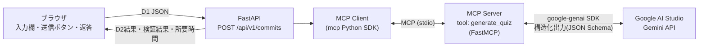

# MCP連携 実現性確認アプリ 計画書

## 1. 目的

nanicommit設計書のうち **「FastAPI（MCP Client）→ 問題生成MCP Server（`generate_quiz`）→ AI」** の部分だけを切り出し、次を確認する。

- FastAPIからMCP Clientとして、MCP Serverの `generate_quiz` toolを呼び出せるか
- MCP Serverの中でGoogle AI Studio（Gemini API）を使い、D2形式の4択3問を生成できるか
- 返ってきた結果を、設計書6章 D2の検証ルールで検証できるか
- 所要時間（設計書の目安：MCP呼び出し20秒以内）

## 2. 対象範囲

| 対象 | 対象外 |
| --- | --- |
| D1（6項目JSON）の受信 | Supabase Auth / DB / 保存 |
| D1 → D2 argumentsへの変換 | X-User-Id・JWT認証 |
| MCP経由の `generate_quiz` 呼び出し | Go CLI・Git Hooks・Next.js |
| Gemini（Google AI Studio）での問題生成 | 採点・回答・push確認（D3〜D5） |
| D2結果の形式検証・画面表示 | 冪等性（同一SHAの再送判定）・409 |

## 3. 構成



- **FastAPIはGeminiを直接呼ばない**（設計書の方針どおり）。Gemini APIキーを持つのはMCP Serverだけ。
- MCP ServerはFastAPIとは別プロセス。PoCではFastAPIがリクエストごとにstdioでMCP Serverを起動・接続する（下の質問1参照）。

## 4. データの流れ

1. 画面の入力欄に **D1（6項目JSON）** を入れる（初期値は設計書のサンプルD1）
2. 「送信」で `POST /api/v1/commits` へ送る
3. FastAPIがD1をPydanticで検証（commit_shaの40/64桁hex、filesが配列 等）
4. D1から `message`・`files`・`diff` を取り出し、`question_count=3, choice_count=4, language="ja"` を加えて **D2 arguments** を作る
5. MCP Client が `generate_quiz` を呼ぶ
6. MCP Server がGeminiへ出題条件（設計書D2のプロンプト）と入力を渡し、JSON Schema指定の構造化出力で `{"questions":[...]}` を受け取って返す
7. FastAPIが設計書どおり検証：3問・選択肢4つで重複なし・`correct_index` 0〜3・文字列が空でない
8. 画面に返答を表示

### 返答の形式（画面表示用）

設計書のD1応答（`quiz_id`/`quiz_url`）はDB保存が前提なので、本PoCでは **実現性確認に必要な情報** を返す。

```json
{
  "status": "ok",
  "elapsed_ms": 8421,
  "mcp_arguments": { "message": "...", "files": [...], "diff": "...", "question_count": 3, "choice_count": 4, "language": "ja" },
  "result": { "questions": [ { "question": "...", "choices": ["..","..","..",".."], "correct_index": 0, "hint": "...", "explanation": "..." } ] },
  "validation_errors": []
}
```

失敗時は設計書の共通エラーに合わせる：422（入力不正・根拠不足）、502（MCP Serverの返却データ不正）、503（MCP Serverに接続できない）、504（タイムアウト）。

## 5. UI

1ページだけ（FastAPIが静的HTMLを配信、フレームワークなし）。

```
┌──────────────────────────────────────────┐
│ 送るデータ（D1 JSON）                      │
│ ┌──────────────────────────────────────┐ │
│ │ { "repository_id": "...", ... }       │ │
│ └──────────────────────────────────────┘ │
│ [ 送信 ]                                  │
│ 返答                                      │
│ ┌──────────────────────────────────────┐ │
│ │ { "status": "ok", ... }  (整形JSON)    │ │
│ └──────────────────────────────────────┘ │
└──────────────────────────────────────────┘
```

## 6. ディレクトリ

設計書8.5のbackend構成に寄せる。

```
mcp-test/
├── PLAN.md
├── README.md                 # 起動手順
├── requirements.txt          # fastapi, uvicorn, mcp, google-genai, pydantic
├── .env.example              # GEMINI_API_KEY, GEMINI_MODEL, MCP_TIMEOUT_SEC
├── app/
│   ├── main.py               # FastAPI：画面配信・POST /api/v1/commits
│   ├── schemas.py            # D1・D2のPydanticモデル
│   ├── static/index.html     # 入力欄・送信ボタン・返答
│   └── learning/
│       ├── mcp_client.py     # MCP Serverへの接続・call_tool
│       └── generate.py       # D1→D2変換・結果検証
├── mcp_server/
│   └── server.py             # FastMCP：generate_quiz（Gemini呼び出し）
└── tests/
    └── test_validate.py      # 検証ロジックのテスト（Gemini不要）
```

## 7. 技術選定

| 項目 | 採用 |
| --- | --- |
| 言語 | Python 3.11+ |
| Web | FastAPI + uvicorn |
| MCP | 公式 `mcp` Python SDK（Server: FastMCP / Client: ClientSession） |
| AI | Google AI Studio（`google-genai` SDK）、モデルは環境変数 `GEMINI_MODEL` で切替（既定 `gemini-3.8-flash`） |
| 出力形式 | Geminiの `response_schema`（JSON Schema）で構造化出力を強制 |
| タイムアウト | MCP呼び出し20秒（設計書8.2の案） |

## 8. 作業手順

1. 雛形・requirements・.env.example 作成
2. MCP Server（`generate_quiz`）実装 → MCP Inspector等で単体確認
3. FastAPI + MCP Client + 検証ロジック実装
4. 画面（index.html）実装
5. 検証ロジックの単体テスト
6. 実際のGemini APIキーで疎通確認（この環境にキーが無い場合は、キー無しで動く部分まで確認し、手順をREADMEに記載）
7. commit・push

## 9. 完成条件

- 画面にサンプルD1を入れて送信すると、MCP経由でGeminiが作った4択3問（D2形式）が表示される
- 形式不正なD1は422、APIキー不正・MCP Server停止・タイムアウトは対応するエラーとして表示される
- FastAPIのコードにGemini呼び出しが無い（MCP経由のみ）
